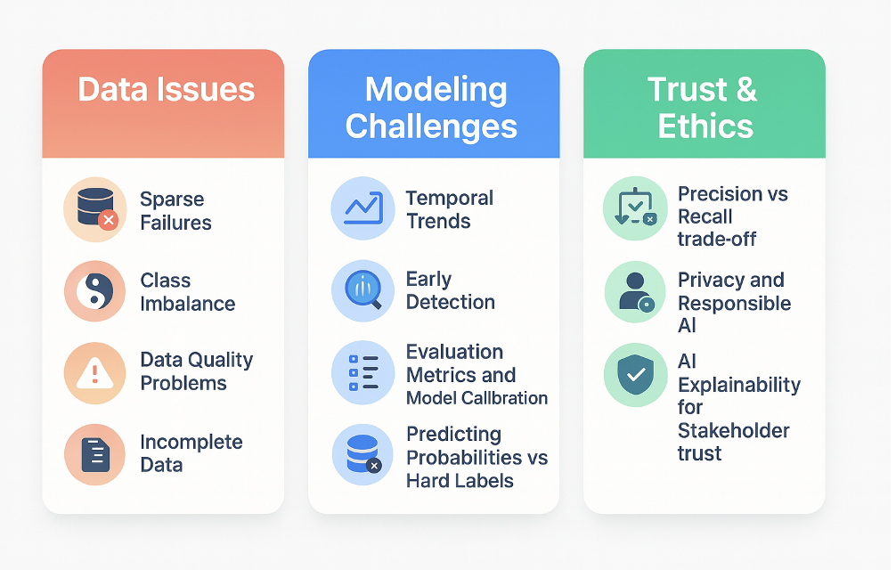

# Topics: 

Following skills are required to deliver ML projects in cloud  production settings.  

1. SQL
2. Apache Spark in databricks
3. Data Modeling
4. Data Pipelines
5. Machine learning Modeling for healthcare and Deep Learning in Genomics and Biomedicine
6. Cloud Architecture Fundamentals
7. PowerBI or tableau
8. Git and fundamentals 
9. Stats and Probability 
10. Python and Algorithms

    
## Learn Machine Learning

### Fundamentals 

TODO: add from blog posts, .tex file 

### Real World Challenges

### Learn Data Science 

### Resources 
